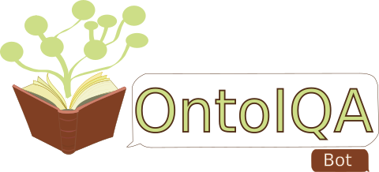
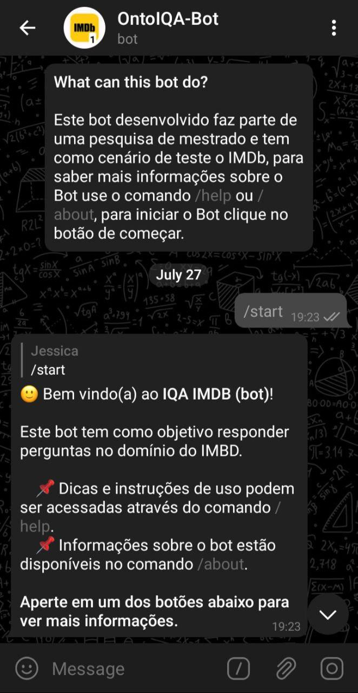
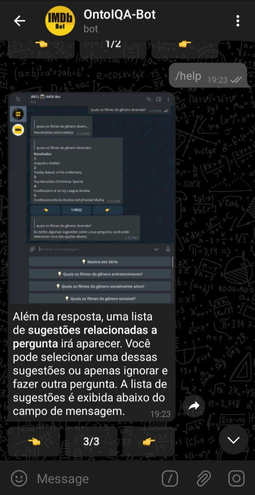
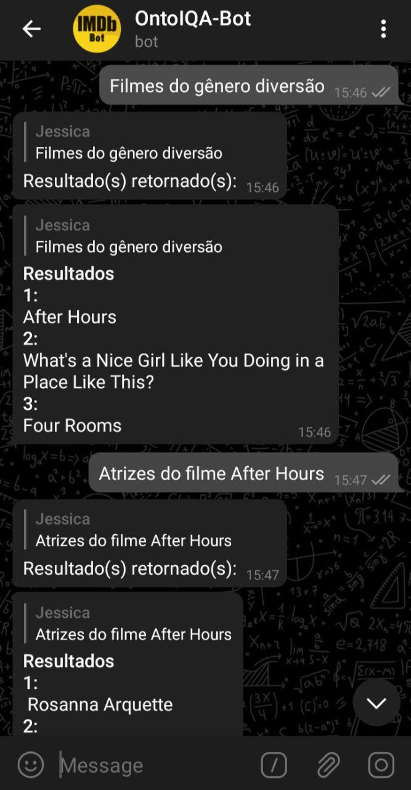
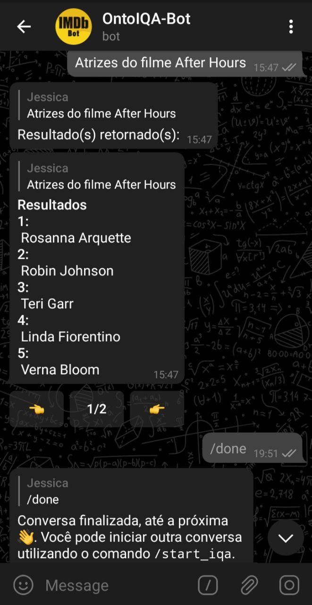

  

<h1 align="center">Onto-Interactive Question Answering Bot </h1> 

Um bot do telegram usando Interactive Question Answer com suporte a ontologias de domínio. Na Figura abaixo mostramos o funcionamento do nosso bot no aplicativo de mensagem do Telegram. Nos arquivos *template.ini* e *template.json* é possível realizar pequenos ajustes no modo de exibição das mensagens, bem como alterar os textos padrões exibidos pelos comandos /start, /help, /done, /about e /start_iqa. Caso decida definir uma mídia nas mensagens de **boas-vindas**, **sobre** ou **ajuda**, é necessário fornecer uma mídia em todas as "páginas" da mensagem, o endereço utilizado na mídia é o *file_id* do arquivo do Telegram, você pode verificar esse atributo ao responder uma mensagem com mídia com o comando `/show_json`.

  
   
  
  

